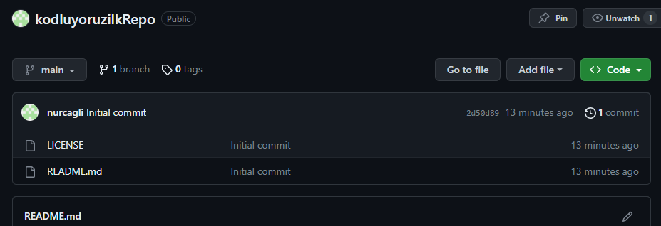

# kodluyoruzilkRepo

Kodluyoruz Eğitimi kapsamında açtığım ilk repo.İçerisinde bir adet Readme dosyası, bir adet de index.html barındırıyor.

## Installation

Öncelikle projeyi clonelayın.
'''
git clone https://github.com/nurcagli/kodluyoruzilkRepo.git
'''

## Usage 

Projeyi cloneladıktan sonra Visual Studio Code programında açın.
Linux için:
'''
cd KodluyoruzIlkRepo
code .
'''

## Contrıbutıng

Pull requestler kabul edilir. Büyük değişiklikler için lütfen önce neyi değiştirmek istediğinizi tartışmak için bir konu açınız.

## Lıcence

[MIT](https://choosealicense.com/licenses/mit/)

